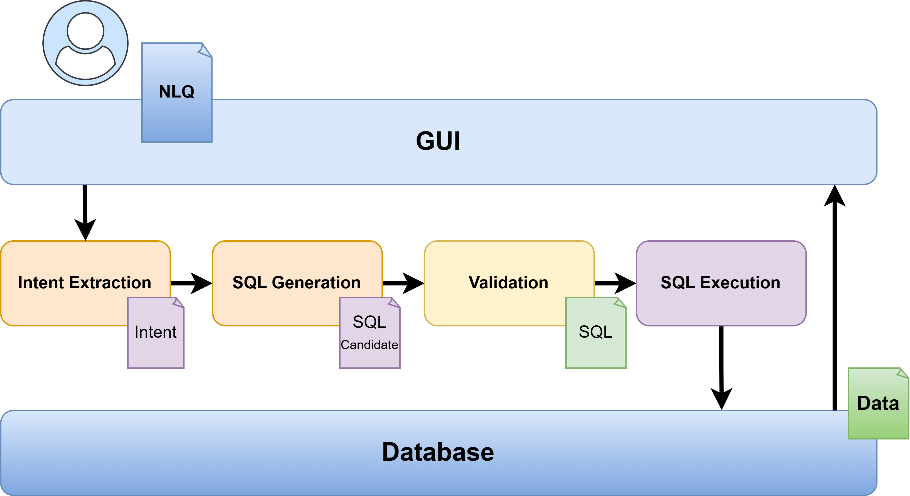

# Intelligent Modular System for Translating Natural Language Queries (NLQs) into SQL using LLMs

Natural Language to SQL system developed as a final degree project (TFG) graded 10/10, and proposed for honors.
The system translates user queries written in natural language into SQL, executes them on a PostgreSQL database, and returns the resulting value.

The architecture is modular and built using LangGraph to orchestrate LLM reasoning steps.

## Authors

- Fidel Nuñez Friera (Developer, Author)
- Dr. Mario San-Emeterio de-la-Parte (Project Manager, Supervisor, UPM)
 
## License

This project is dual-licensed. See LICENSE file.

## Academic reference

This bachelor’s thesis manuscript is archived in the official UPM institutional repository:

https://oa.upm.es/93684/

This repository contains the implementation accompanying the archived manuscript.

## Overview

The pipeline is composed of four main stages:

1. **Intent extraction**  
   The LLM interprets the semantic goal of the user query.

2. **SQL generation**  
   A second prompt transforms the interpreted intent into a SQL query.

3. **SQL validation**  
   The query is validated syntactically using PostgreSQL `EXPLAIN` and restricted to SELECT-only.

4. **Execution**  
   The query is executed and the result is returned to the user.

This design separates reasoning, generation, validation, and execution to improve reliability.

---

## Architecture

User NLQ → Intent extraction (LLM) → SQL generation (LLM) → Validation → Execution → Result



The orchestration is implemented with **LangGraph**,
using a typed state model and explicit routing.

---

## Tech stack

- Python 3.11+
- Flask
- LangGraph
- LangChain
- PostgreSQL
- Pydantic
- python-dotenv

---

## Project structure

```
app.py                  → Flask API entrypoint
config.py               → Environment configuration
langgraph_builder.py    → LangGraph pipeline

modules/
  extract_intent.py     → Intent extraction module
  generate_sql.py       → SQL generation module
  validate_sql.py       → Validation module
  execute_sql.py        → Execution module
  prompts/
    intent_prompt.txt   → Prompt used for intent extraction
    sql_prompt.txt      → Prompt used for SQL generation

templates/
  interface.html        → User interface
```

---

## Installation

1. Clone the repository:

git clone https://github.com/fidelnunezfriera/nlq-to-sql-llm.git
cd nlq-to-sql-llm

2. Create environment:

python -m venv .venv
.venv\Scripts\activate

3. Install dependencies:

pip install -r requirements.txt

4. Environment variables

Create a .env file in the project root:

OPENAI_API_KEY=your_api_key
DB_NAME=...
DB_USER=...
DB_PASSWORD=...
DB_HOST=...
DB_PORT=...

Or copy:

.env.example → .env

5. Running the server

python app.py

The API will be available at:

http://localhost:5000

## Example request

Input:

"How many cows got fever last year?"

Response:

"17"

## Notes

The prompts included in this repository are those specifically designed for the database used in the bachelor’s thesis.
The original dataset cannot be distributed due to confidentiality constraints.
However, the system architecture is database-agnostic and can be adapted to other PostgreSQL schemas.

To apply the system to a different database, the prompts should be updated to explicitly describe the schema and domain context. The included prompts can be used as a reference template.

In the original context, the system was specialized for agricultural data, which explains the farmer-oriented language in the intent prompt.
